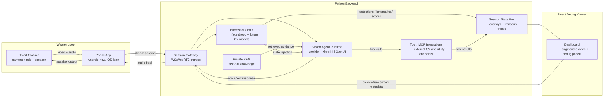
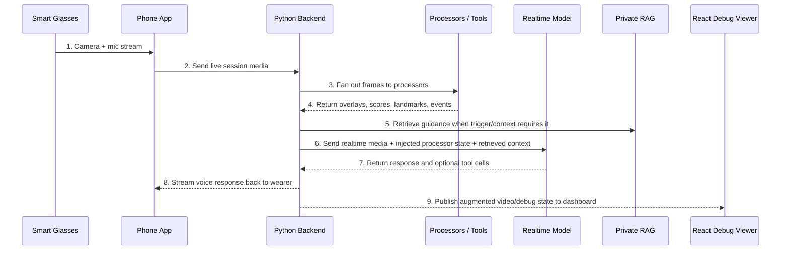

# Realtime Vision Agent Architecture

This document describes the planned backend-first architecture for a smart-glasses first-aid guidance system built from the `droopdetection` repo root.

The core idea is:
- the glasses wearer gets voice guidance
- the phone streams video/audio into our Python backend
- the backend runs Vision Agents with configurable processors, tools, and RAG
- a React debug dashboard shows the augmented video and internal agent state

## Diagram Intent

Show how media moves from glasses to phone to backend to model, where augmentation happens, and what gets rendered in the debug viewer.

## Tier 1 Map

## Tier 2: Numbered Data Flow

## Legend

- `Raw media`: live video/audio coming from glasses through the phone
- `Processor state`: structured outputs such as scores, boxes, points, poses, labels
- `Augmented video`: rendered overlay view for judges/developers
- `Realtime model`: Gemini or OpenAI selected by config in Vision Agents

## Recommended V1 Semantics

### What the backend owns

- session ingress from the app
- provider selection between Gemini and OpenAI
- processor registration and ordering
- tool exposure
- private RAG retrieval
- debug event publishing
- overlay rendering for the dashboard

### What the phone app owns

- glasses connection and media capture
- session authentication to the backend
- playback of model voice responses
- later: switching between direct-device mode and backend mode

### What the React viewer owns

- showing augmented video
- showing processor outputs such as boxes, points, masks, poses, and scores
- showing agent/debug panels such as transcript, tool activity, and retrieved guidance

## Answering the Two Key Design Questions

### 1. Can we integrate other models as plugins through processors?

Yes.

That is the right mental model. Vision Agents processors are the seam for attaching custom CV models and frame transforms. In practice, we can support multiple integration styles:

- local Python model inside a custom `VideoProcessor`
- cloud CV endpoint exposed as a tool/function
- hybrid approach where a processor does frame sampling and a tool does heavyweight inference

That means face droop detection can be one processor today, and later we can add others like:

- pose or fall analysis
- bleeding / injury detection
- object or scene hazard detection
- hand landmark or gesture checks
- multimodal robotics-style outputs with points, boxes, and structured observations

### 2. Is it correct to say the video gets sent to the realtime API with the augmentation?

Partly, but the more correct statement is:

> The backend sends live video to the realtime model and enriches that session with processor outputs, tool results, and RAG context. The augmented video is primarily for the debug viewer, while the model usually benefits most from structured processor state plus the original media.

There are two valid patterns:

- `State injection pattern`
  - send raw video to the realtime model
  - inject processor outputs as structured context
  - publish augmented overlays to the dashboard
- `Transformed video pattern`
  - processor draws annotations onto frames
  - annotated video is published back out as a transformed stream
  - optionally send that transformed stream onward when the use case benefits

For v1, the recommended design is:

- raw video remains the primary model input
- processor outputs are injected as structured state/events
- augmented video is rendered for the React debug dashboard

This keeps the AI input clean while still making the augmentation visible to judges.

## Example Session

Before:
- phone streams video directly to a realtime model client
- processor outputs are not visible as a first-class backend system

After:
- phone streams video to our Python backend
- backend runs face-droop detection and optional tool/RAG augmentation
- backend sends enriched context into Gemini or OpenAI realtime
- wearer hears guidance through audio
- dashboard shows overlays and internal agent traces

## Extensibility Plan

The backend should treat each augmentation as a configurable integration:

- `processors/*`: frame-local models and overlay generators
- `tools/*`: async function tools for external endpoints
- `rag/*`: private knowledge connectors
- `providers/*`: Gemini/OpenAI realtime selection
- `sessions/*`: live media session orchestration

This makes it straightforward to add new detectors without changing the phone app contract.

## References

- Vision Agents video agents overview: https://visionagents.ai/introduction/video-agents
- Vision Agents processors core: https://visionagents.ai/core/processors-core
- Vision Agents video processors guide: https://visionagents.ai/guides/video-processors
- Vision Agents MCP/tool calling: https://visionagents.ai/guides/mcp-tool-calling
- Vision Agents RAG guide: https://visionagents.ai/guides/rag
- Vision Agents memory/chat guide: https://visionagents.ai/guides/chat-and-memory
