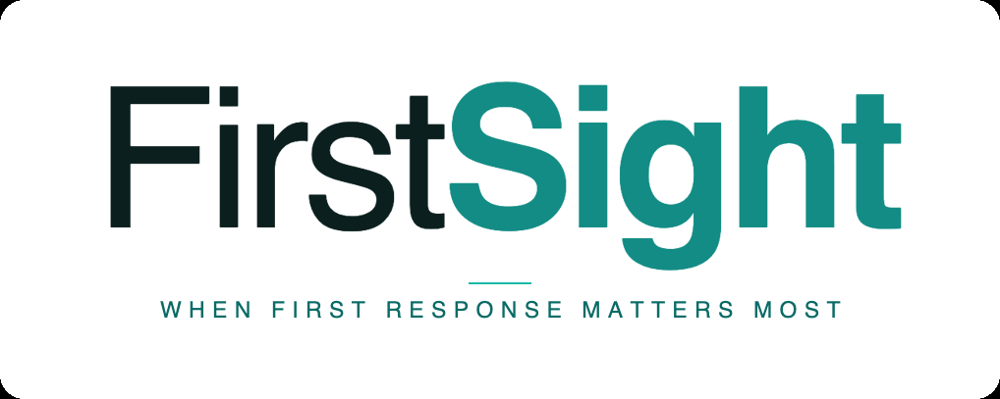
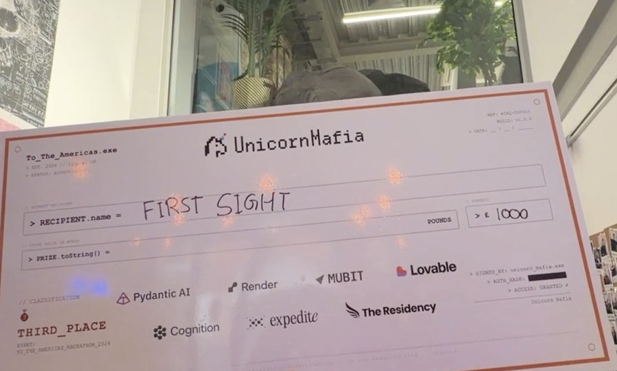
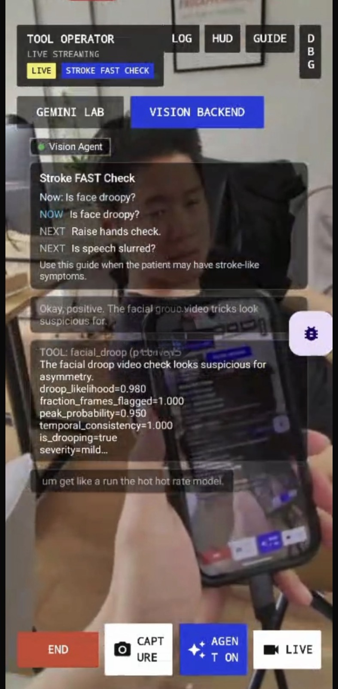
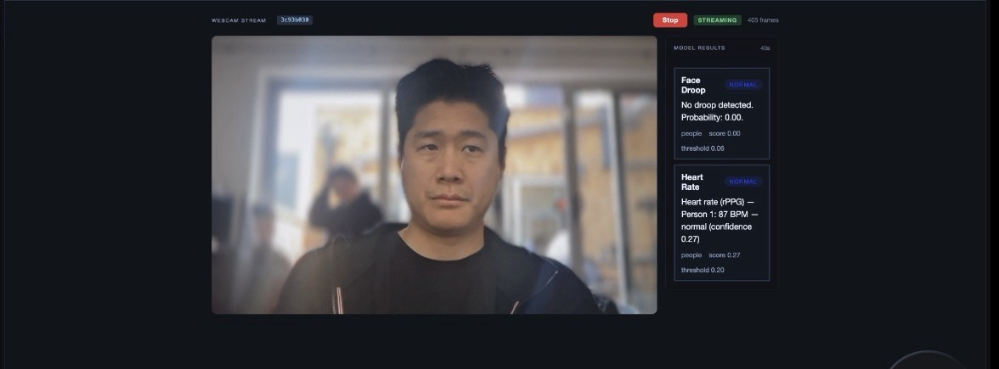
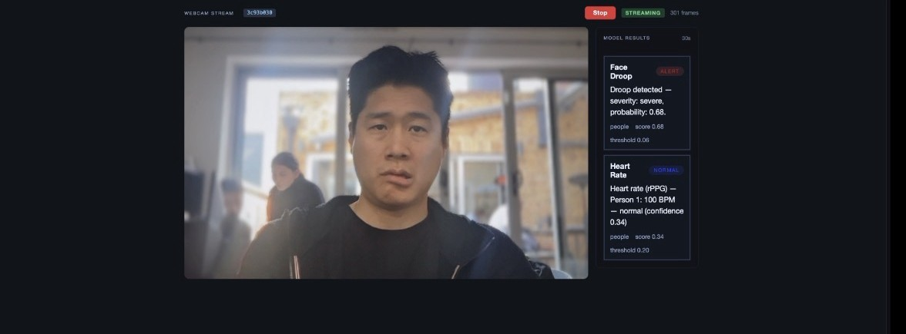
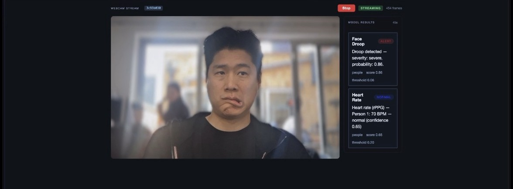
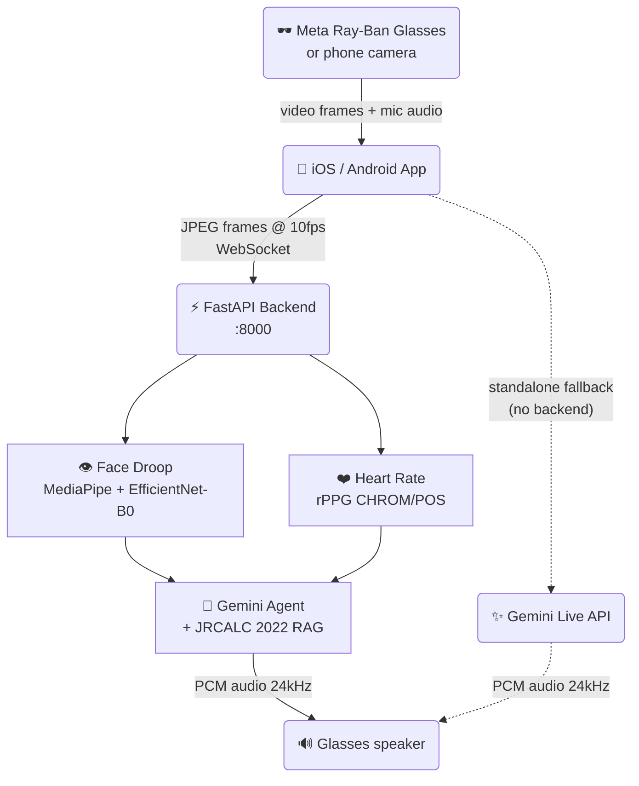
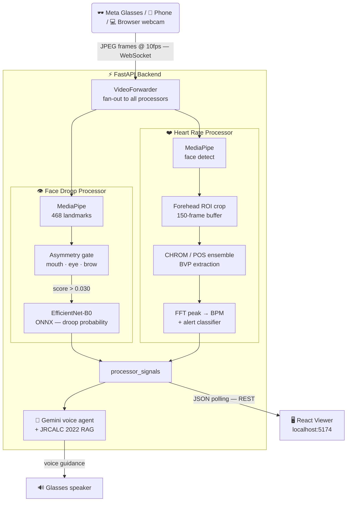
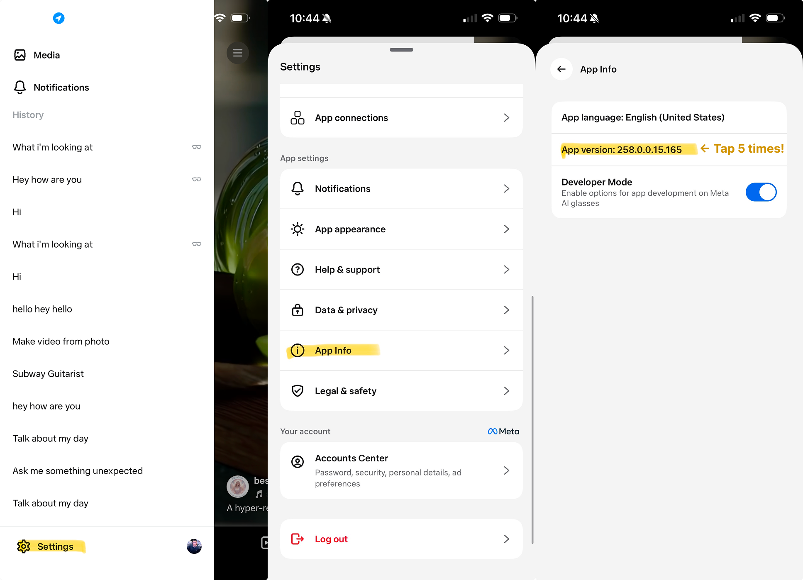

<p align="center">
  
</p>

A smart-glasses first-aid guidance system. Point the glasses (or your phone/laptop camera) at a patient — the backend runs two real-time CV models and an AI voice agent that talks you through what it sees:

- **Facial droop** — detects stroke-related asymmetry using MediaPipe landmarks + EfficientNet-B0
- **Heart rate** — contactless remote photoplethysmography (rPPG) from skin colour (YOLOR head detection + CHROM/POS ensemble, no contact needed)
- **Voice guidance** — Gemini agent backed by JRCALC 2022 clinical guidelines RAG

**Supported platforms:** browser webcam, iOS (iPhone), Android, Meta Ray-Ban glasses.

---

<p align="center">
  
</p>

<p align="center"><strong>🏆 3rd Place — UnicornMafia "To The Americas" Hackathon 2026</strong><br/>
Sponsored by Pydantic AI · Render · MUBIT · Lovable · Cognition · Expedite · The Residency</p>

---

## What It Can Do

### Detect a stroke before it's obvious
Point the glasses at someone's face. FirstSight runs a MediaPipe landmark extractor and an EfficientNet-B0 model on every frame, scoring mouth, eye, and brow asymmetry in real time. Asymmetric faces — a key FAST indicator — are flagged immediately, with severity graded `none / mild / severe`. AUROC 0.985 on held-out test data.

### Measure heart rate without touching anyone
The remote photoplethysmography (rPPG) pipeline picks up the ~1% colour change skin makes with each heartbeat. No sensor. No contact. Works across skin tones — a CHROM/POS ensemble automatically selects the algorithm with the stronger signal, so darker Fitzpatrick types aren't misread. Alerts fire for bradycardia, tachycardia, and critical ranges (<40 or >180 BPM) after a sustained window to suppress false alarms.

### Talk you through what to do
A Gemini voice agent backed by JRCALC 2022 clinical guidelines listens, watches, and speaks — walking you step by step through stroke assessment, CPR, choking response, and more. It correlates what the CV models see with what you say to surface the right protocol at the right moment.

### Stream from anything
Browser webcam, iPhone, Android phone, or Meta Ray-Ban glasses via the DAT SDK. The backend accepts JPEG frames over WebSocket from any source — swap the input without changing a line of server code.

### Give operators full visibility
A React debug dashboard shows the live annotated frame, processor signal cards, Gemini transcript, and full event trace — so a judge, operator, or paramedic supervisor can see exactly what the system detected and why.

## See It In Action

<p align="center">
  
</p>

<p align="center"><em>Live on Meta Ray-Ban glasses — Stroke FAST Check playbook running, facial droop detected (likelihood 0.98), Voice Agent active.</em></p>

---

Three frames from a live webcam session — same person, same room, models running in real time.

| Normal face | Mild asymmetry | Exaggerated droop |
|:-----------:|:--------------:|:-----------------:|
|  |  |  |
| Face Droop: **NORMAL** (0.00) | Face Droop: **ALERT** severe (0.68) | Face Droop: **ALERT** severe (0.86) |
| Heart Rate: **87 BPM** | Heart Rate: **100 BPM** | Heart Rate: **70 BPM** (conf 0.65) |

The system correctly reads 0.00 on a symmetric face and jumps to 0.86 on an exaggerated droop — with heart rate running contactlessly in parallel the whole time.

---

If you are joining this repo as a teammate, start here:

- [ARCHITECTURE.md](ARCHITECTURE.md) for the backend data-flow design
- [`backend/`](backend/) for the Python service
- [`viewer/`](viewer/) for the React debug dashboard
- [`mobile/CameraAccess/`](mobile/CameraAccess/) for the iOS prototype
- [`mobile/CameraAccessAndroid/`](mobile/CameraAccessAndroid/) for the Android prototype

## Quick Start (Browser Demo)

The fastest way to see both models running — no mobile hardware required.

**Prerequisites:** Python 3.11–3.13, Node 18+, a [Gemini API key](https://aistudio.google.com/apikey).

### 1. Clone and configure

```bash
git clone https://github.com/dtseng123/droopdetection.git
cd droopdetection
cp backend/.env.example backend/.env   # then set GEMINI_API_KEY
```

> **Model files required for droop detection.** The trained weights are not in the repo.
> Place these files before starting the backend:
> ```
> model/droop_model.onnx          ← EfficientNet-B0 ONNX weights
> model/face_landmarker.task      ← MediaPipe face landmarker (download from MediaPipe)
> checkpoints/threshold.json      ← calibrated detection threshold
> ```
> Heart rate works out of the box — the BlazeFace model downloads automatically on first run.

### 2. Start the backend

```bash
cd backend
make setup        # creates .venv, installs deps
make dev          # starts uvicorn on :8000
```

Health check:

```bash
curl http://127.0.0.1:8000/health
```

### 3. Start the viewer

```bash
cd viewer
npm install
npm run dev       # starts on http://localhost:5174
```

### 4. Stream your webcam

1. Open **http://localhost:5174**
2. Go to the **STREAMS** tab
3. Click **Start Camera** — your browser webcam streams to the backend at 10 fps
4. A 10-second warmup bar appears while the processors initialise
5. After warmup, two signal cards update in real time:
   - **Face droop** — probability and severity, updated each frame
   - **Heart rate** — BPM reading once the 150-frame rPPG buffer fills (~15 s)

### 5. Android / iOS (optional)

See the mobile quick-start sections below to stream from Meta Ray-Ban glasses or a phone camera instead of the browser webcam.

Useful commands:

```bash
make backend-test
make backend-restart
make backend-stop
```

## Secrets And Tokens

Start by copying the root inventory file:

```bash
cp .env.example .env
```

That root `.env` is the teammate-facing checklist for all keys used in this repo. The apps do not all read it directly, so use it as the place you collect values, then copy them into the runtime-specific files below.

### Where Each Secret Actually Goes

| Surface | File | What goes there |
|------|---------|---------|
| Root inventory | `.env` | Shared local checklist for Gemini, OpenAI, Stream, and Meta/DAT values |
| Backend | `backend/.env` | Vision Agents / FastAPI runtime config |
| iOS sample app | `mobile/CameraAccess/CameraAccess/Secrets.swift` | `geminiAPIKey`, optional WebRTC signaling URL |
| Android sample app | `mobile/CameraAccessAndroid/app/src/main/java/com/meta/wearable/dat/externalsampleapps/cameraaccess/Secrets.kt` | `geminiAPIKey`, optional WebRTC signaling URL |
| Android DAT SDK | `mobile/CameraAccessAndroid/local.properties` | `github_token`, `mwdat_application_id`, `mwdat_client_token` |

### Backend `.env`

The backend already has a runnable template:

```bash
cp backend/.env.example backend/.env
```

Or use the Make target:

```bash
make backend-setup
```

Fill in these keys for the backend as needed:

- `GEMINI_API_KEY` for Gemini realtime
- `OPENAI_API_KEY` for OpenAI realtime
- `ELEVENLABS_API_KEY` if you want backend-generated PCM speech instead of Android local TTS fallback
- `STREAM_API_KEY` and `STREAM_API_SECRET` for the Vision Agents transport layer

The current Vision Agent backend mode defaults to:

- `SPEECH_PIPELINE=fast_whisper_pipeline`
- `FAST_WHISPER_MODEL_SIZE=base`
- `GEMINI_LLM_MODEL=gemini-3-flash-preview`
- `BACKEND_TTS_ENABLED=true`

If `ELEVENLABS_API_KEY` is absent, the backend still runs Fast-Whisper + Gemini and the Android app falls back to local TTS playback.
These values can also be overridden per session from the Android app Settings screen.

### Meta / DAT Android Tokens

The Android sample needs two different things:

1. A GitHub Packages token so Gradle can download the DAT Android SDK.
2. Meta Wearables app registration values when you are not relying on Developer Mode.

Create the Android local properties file:

```bash
cp mobile/CameraAccessAndroid/local.properties.example mobile/CameraAccessAndroid/local.properties
```

Then fill in:

- `github_token`
  - create a GitHub Personal Access Token with `read:packages`
  - GitHub path: `Settings -> Developer settings -> Personal access tokens`
- `mwdat_application_id`
  - use `0` in Developer Mode
  - for production, get the real value from Wearables Developer Center
- `mwdat_client_token`
  - empty in simple Developer Mode workflows if not required by your current setup
  - for production, get the real value from Wearables Developer Center

Important:

- `mobile/CameraAccessAndroid/settings.gradle.kts` reads `github_token`
- `mobile/CameraAccessAndroid/app/build.gradle.kts` reads `mwdat_application_id` and `mwdat_client_token`
- `mobile/CameraAccessAndroid/app/src/main/AndroidManifest.xml` injects those into the DAT manifest metadata

### iOS And Android App Secrets

Create the sample app secrets files:

```bash
cp mobile/CameraAccess/CameraAccess/Secrets.swift.example mobile/CameraAccess/CameraAccess/Secrets.swift
cp mobile/CameraAccessAndroid/app/src/main/java/com/meta/wearable/dat/externalsampleapps/cameraaccess/Secrets.kt.example mobile/CameraAccessAndroid/app/src/main/java/com/meta/wearable/dat/externalsampleapps/cameraaccess/Secrets.kt
```

At minimum, set:

- `geminiAPIKey`

Optional:

- WebRTC signaling URL

## Repo Map

| Path | Purpose |
|------|---------|
| `mobile/CameraAccess/` | Current iOS smart-glasses / iPhone prototype |
| `mobile/CameraAccessAndroid/` | Current Android smart-glasses / phone prototype |
| `mobile/CameraAccess/server/` | Current WebRTC signaling server for the existing browser viewer |
| `backend/` | FastAPI + Vision Agents backend — face droop, heart rate, RAG |
| `viewer/` | React debug dashboard for backend session state, transcripts, and processor signals |
| [`ARCHITECTURE.md`](ARCHITECTURE.md) | Backend system architecture and data-flow design |

Compatibility note: `samples/CameraAccessAndroid` is kept as a forwarding symlink for older Android Studio projects and scripts. The canonical Android app path is `mobile/CameraAccessAndroid/`.

## Product Direction

The long-term product direction for this repo is a first-aid guidance system:

- the glasses wearer streams live video/audio from their point of view
- the backend runs custom vision models and other integrations through processors and tools
- private medical / first-aid knowledge can be retrieved through RAG
- the wearer receives voice guidance
- judges, developers, and operators can inspect the augmented video and agent traces in a debug dashboard

The backend-first system is built and running. The mobile apps can stream camera and audio to the backend for real-time CV and voice guidance, or connect directly to Gemini Live as a standalone fallback.

## Mobile Standalone Mode

When running without the backend, the iOS and Android apps connect directly to Gemini Live for voice and vision:

- **"What am I looking at?"** -- Gemini sees through your glasses camera and describes the scene
- **"What do I do next?"** -- voice guidance from Gemini's built-in knowledge

The glasses camera streams at ~1fps to Gemini for visual context, while audio flows bidirectionally in real-time.

## Mobile Flow



**Key pieces:**
- **FastAPI backend** -- runs CV processors and a Gemini voice agent with JRCALC clinical RAG
- **Face droop** -- MediaPipe landmarks + EfficientNet-B0, asymmetry-gated
- **Heart rate** -- contactless rPPG via CHROM/POS ensemble
- **Phone / glasses mode** -- test with your phone camera instead of Meta Ray-Ban glasses
- **Standalone fallback** -- iOS/Android can also connect directly to Gemini Live when no backend is available

For architecture details, see [ARCHITECTURE.md](ARCHITECTURE.md).

## How the Backend Works



### Face droop detection

1. Each frame is passed through MediaPipe face landmarker to extract 468 landmarks.
2. Mouth/eye/brow asymmetry is computed from left–right landmark differences.
3. **Asymmetry gate**: if the face is symmetric (combined score < 0.030) the CNN is skipped and the frame is logged as not drooping. This eliminates false positives on resting faces.
4. If asymmetry exceeds the gate, an EfficientNet-B0 ONNX model runs on the forehead crop. The final probability is the CNN output scaled by the asymmetry weight.
5. Severity bands: `none / mild / severe` based on distance from the calibrated threshold.

### Heart rate (rPPG)

1. **YOLOR** detects heads/faces with a MediaPipe BlazeFace fallback for non-frontal angles (top-down crib cameras, people lying down). **DeepSort** tracks identities across frames so each person gets an independent BPM reading.
2. A forehead ROI is cropped (top 40% of face height) — the flattest skin region with the strongest pulse signal and fewest expression artefacts.
3. ROIs accumulate in a 150-frame rolling buffer (~15 s at 10 fps).
4. When the buffer is full, CHROM and POS colour-space BVP estimators run and their spectra are averaged. The dominant peak in the physiological band (60–120 BPM) gives the heart rate.
5. Frame-diff motion rejection discards blurry or high-motion frames before they enter the buffer.

### API surfaces

| Endpoint | Purpose |
|----------|---------|
| `POST /sessions` | Create ingest session |
| `WS /sessions/{id}/stream` | Stream JPEG frames + audio |
| `GET /sessions` | List active sessions |
| `GET /sessions/{id}` | Session state + processor signals |
| `GET /sessions/{id}/frame` | Latest annotated preview JPEG |
| `GET /health` | Liveness check |

### Key files

| File | Purpose |
|------|---------|
| `backend/app/processors/face_droop.py` | Droop processor |
| `backend/app/processors/droop_inference.py` | ONNX wrapper + asymmetry gate |
| `backend/app/preprocess.py` | MediaPipe landmark extraction |
| `backend/app/processors/heart_rate/processor.py` | rPPG processor |
| `backend/app/processors/heart_rate/signal_processor.py` | CHROM/POS BVP estimators |
| `backend/app/agent_factory.py` | Wires processors + LLM + RAG |
| `viewer/src/CameraStream.tsx` | Webcam streaming + signal cards |

---

## JRCALC Clinical Guidelines RAG

The backend includes a Graph RAG pipeline that searches the JRCALC 2022 Clinical Practice Guidelines — the definitive UK paramedic reference — and surfaces relevant guidance in real time during a session.

### How it works

When the glasses wearer speaks, the backend automatically searches the JRCALC document and injects matching guidance into the AI's context before it responds. No special command is needed — just ask naturally:

- *"What's the adrenaline dose for cardiac arrest?"* — the AI receives the exact dose table row from the JRCALC drug doses section
- *"Walk me through stroke assessment"* — the AI receives the FAST assessment protocol and management steps
- *"Is the patient breathing?"* — semantic search finds airway and breathing management sections

The search uses a knowledge graph (NetworkX) on top of a FAISS vector index. Each piece of the document — chapters, sections, paragraphs, and table rows — is a node. When a query matches a node, the graph traversal also pulls in related nodes: the parent section for context, sibling chunks, and every other place the same drug or condition is mentioned across different chapters. This means a query for "adrenaline" returns the cardiac arrest dose, the anaphylaxis dose, and the paediatric dose in a single retrieval pass.

The retrieved guidance is prepended to the AI's prompt, labelled `Retrieved clinical guidance (JRCALC 2022)`, so the AI can cite and reason over it while also using what it sees through the camera.

### Setup

**Step 1 — Get the EPUB**

Place the JRCALC 2022 EPUB at:

```
data/jrcalc-clinical-guidelines-2022.epub
```

**Step 2 — Build the index** (one-time, ~5–8 minutes)

```bash
cd backend
python -m scripts.build_rag_index \
  --epub data/jrcalc-clinical-guidelines-2022.epub \
  --out rag_index \
  --gemini-api-key $GEMINI_API_KEY
```

This produces a `rag_index/` directory containing the FAISS vector index and the NetworkX graph. Expected output:

```
Ingesting EPUB: data/jrcalc-clinical-guidelines-2022.epub
  Ingestion done in 12.3s
  Nodes total: 7842
    chapter: 48
    section: 312
    text_chunk: 4201
    table: 198
    table_row: 2841
    entity: 242
  Edges total: 18934
Building NetworkX graph...
  Graph saved in 0.4s → rag_index/graph.pkl
Building FAISS index (embedding via Google text-embedding-004)...
  FAISS index saved in 287.1s → rag_index/faiss.index  (7594 vectors)

Done. Total time: 299.8s
```

**Step 3 — Enable in `.env`**

Add to `backend/.env`:

```env
RAG_ENABLED=true
```

Optional tuning:

```env
RAG_TOP_K=6                  # number of nodes returned per query (default: 6)
RAG_MAX_CONTEXT_TOKENS=1200  # max tokens of guidance injected per turn (default: 1200)
RAG_INDEX_DIR=rag_index      # path to the built index (default: rag_index)
```

**Step 4 — Restart the backend**

```bash
make backend-restart
```

The backend logs confirm the index loaded:

```
rag retriever loaded index_dir=rag_index nodes=7842 vectors=7594 top_k=6
```

### What gets searched

The JRCALC document is indexed at four levels of granularity:

| Node type | Example |
|---|---|
| Chapter | "Cardiac Arrest" |
| Section | "Management — Adult" |
| Paragraph | "CPR should be initiated immediately..." |
| Table row | `Drug: Adrenaline | Dose: 1mg | Route: IV/IO | Notes: Every 3-5 min` |

Drug and condition names become entity hub nodes. A query for "adrenaline" finds the entity hub and follows its connections to every dose table row across all conditions — cardiac arrest, anaphylaxis, bradycardia — in one retrieval pass.

### Disabling

Set `RAG_ENABLED=false` (or omit it entirely — it defaults to `false`). The rest of the pipeline is completely unaffected.

---

## Quick Start: Current iOS Prototype

### 1. Clone and open

```bash
git clone https://github.com/dtseng123/droopdetection.git
cd droopdetection/mobile/CameraAccess
open CameraAccess.xcodeproj
```

### 2. Add your secrets

Copy the example file and fill in your values:

```bash
cp CameraAccess/Secrets.swift.example CameraAccess/Secrets.swift
```

Edit `Secrets.swift` with your [Gemini API key](https://aistudio.google.com/apikey) (required) and optional WebRTC config.

### 3. Build and run

Select your iPhone as the target device and hit Run (Cmd+R).

### 4. Try it out

**Without glasses (iPhone mode):**
1. Tap **"Start on iPhone"** -- uses your iPhone's back camera
2. Tap the **AI button** to start a Gemini Live session
3. Talk to the AI -- it can see through your iPhone camera

**With Meta Ray-Ban glasses:**

First, enable Developer Mode in the Meta AI app:

1. Open the **Meta AI** app on your iPhone
2. Go to **Settings** (gear icon, bottom left)
3. Tap **App Info**
4. Tap the **App version** number **5 times** -- this unlocks Developer Mode
5. Go back to Settings -- you'll now see a **Developer Mode** toggle. Turn it on.



Then in the iOS app:
1. Tap **"Start Streaming"** in the app
2. Tap the **AI button** for voice + vision conversation

---

## Quick Start: Current Android Prototype

### 1. Clone and open

```bash
git clone https://github.com/dtseng123/droopdetection.git
```

Open `mobile/CameraAccessAndroid/` in Android Studio.

### 2. Configure GitHub Packages (DAT SDK)

The Meta DAT Android SDK is distributed via GitHub Packages. You need a GitHub Personal Access Token with `read:packages` scope.

1. Go to [GitHub > Settings > Developer Settings > Personal Access Tokens](https://github.com/settings/tokens) and create a **classic** token with `read:packages` scope
2. In `mobile/CameraAccessAndroid/local.properties`, add:

```properties
github_token=YOUR_GITHUB_TOKEN
```

> **Tip:** If you have the `gh` CLI installed, you can run `gh auth token` to get a valid token. Make sure it has `read:packages` scope -- if not, run `gh auth refresh -s read:packages`.
>
> **Note:** GitHub Packages requires authentication even for public repositories. The 401 error means your token is missing or invalid.

### 3. Add your secrets

```bash
cd mobile/CameraAccessAndroid/app/src/main/java/com/meta/wearable/dat/externalsampleapps/cameraaccess/
cp Secrets.kt.example Secrets.kt
```

Edit `Secrets.kt` with your [Gemini API key](https://aistudio.google.com/apikey) (required) and optional WebRTC config.

### 4. Build and run

1. Let Gradle sync in Android Studio (it will download the DAT SDK from GitHub Packages)
2. Select your Android phone as the target device
3. Click Run (Shift+F10)

> **Wireless debugging:** You can also install via ADB wirelessly. Enable **Wireless debugging** in your phone's Developer Options, then pair with `adb pair <ip>:<port>`.

### 5. Try it out

**Without glasses (Phone mode):**
1. Tap **"Start on Phone"** -- uses your phone's back camera
2. Tap the **AI button** (sparkle icon) to start a Gemini Live session
3. Talk to the AI -- it can see through your phone camera

**With Meta Ray-Ban glasses:**

Enable Developer Mode in the Meta AI app (same steps as iOS above), then:
1. Tap **"Start Streaming"** in the app
2. Tap the **AI button** for voice + vision conversation

---

## Current Mobile Architecture

### Key Files (iOS)

All source code is in `mobile/CameraAccess/CameraAccess/`:

| File | Purpose |
|------|---------|
| `Gemini/GeminiConfig.swift` | API keys, model config, system prompt |
| `Gemini/GeminiLiveService.swift` | WebSocket client for Gemini Live API |
| `Gemini/AudioManager.swift` | Mic capture (PCM 16kHz) + audio playback (PCM 24kHz) |
| `Gemini/GeminiSessionViewModel.swift` | Session lifecycle, transcript state |
| `iPhone/IPhoneCameraManager.swift` | AVCaptureSession wrapper for iPhone camera mode |
| `WebRTC/WebRTCClient.swift` | WebRTC peer connection + SDP negotiation |
| `WebRTC/SignalingClient.swift` | WebSocket signaling for WebRTC rooms |

### Key Files (Android)

All source code is in `mobile/CameraAccessAndroid/app/src/main/java/.../cameraaccess/`:

| File | Purpose |
|------|---------|
| `gemini/GeminiConfig.kt` | API keys, model config, system prompt |
| `gemini/GeminiLiveService.kt` | OkHttp WebSocket client for Gemini Live API |
| `gemini/AudioManager.kt` | AudioRecord (16kHz) + AudioTrack (24kHz) |
| `gemini/GeminiSessionViewModel.kt` | Session lifecycle, UI state |
| `phone/PhoneCameraManager.kt` | CameraX wrapper for phone camera mode |
| `webrtc/WebRTCClient.kt` | WebRTC peer connection (stream-webrtc-android) |
| `webrtc/SignalingClient.kt` | OkHttp WebSocket signaling for WebRTC rooms |
| `settings/SettingsManager.kt` | SharedPreferences with Secrets.kt fallback |

### Audio Pipeline

- **Input**: Phone mic -> AudioManager (PCM Int16, 16kHz mono, 100ms chunks) -> Gemini WebSocket
- **Output**: Gemini WebSocket -> AudioManager playback queue -> Phone speaker
- **iOS iPhone mode**: Uses `.voiceChat` audio session for echo cancellation + mic gating during AI speech
- **iOS Glasses mode**: Uses `.videoChat` audio session (mic is on glasses, speaker is on phone -- no echo)
- **Android**: Uses `VOICE_COMMUNICATION` audio source for built-in acoustic echo cancellation

### Video Pipeline

- **Glasses**: DAT SDK video stream (24fps) -> throttle to ~1fps -> JPEG (50% quality) -> Gemini
- **Phone**: Camera capture (30fps) -> throttle to ~1fps -> JPEG -> Gemini

### WebRTC Live Streaming

Share your glasses POV in real-time to a browser viewer with bidirectional audio and video.

1. Tap the **Live** button in the app
2. The app connects to a signaling server and gets a 6-character room code
3. Share the code -- the viewer opens the server URL in a browser and enters it
4. WebRTC peer connection is established (SDP + ICE via the signaling server)
5. Media flows peer-to-peer: glasses video to browser, browser camera back to iOS PiP

**Key details:**
- **Signaling server**: Node.js + WebSocket, located at `mobile/CameraAccess/server/` -- serves the browser viewer and relays SDP/ICE
- **NAT traversal**: Google STUN servers + ExpressTURN relay (fetched from `/api/turn`)
- **Video**: 24 fps, 2.5 Mbps max bitrate
- **Background handling**: 60-second grace period for iOS app backgrounding -- room stays alive for reconnection
- **Constraint**: Cannot run simultaneously with Gemini Live (audio device conflict)

For full details, see [`mobile/CameraAccess/CameraAccess/WebRTC/README.md`](mobile/CameraAccess/CameraAccess/WebRTC/README.md).

---

## Requirements

### iOS
- iOS 17.0+
- Xcode 15.0+
- Gemini API key ([get one free](https://aistudio.google.com/apikey))
- Meta Ray-Ban glasses (optional -- use iPhone mode for testing)

### Android
- Android 14+ (API 34+)
- Android Studio Ladybug or newer
- GitHub account with `read:packages` token (for DAT SDK)
- Gemini API key ([get one free](https://aistudio.google.com/apikey))
- Meta Ray-Ban glasses (optional -- use Phone mode for testing)

---

## Troubleshooting

### General

**Gemini doesn't hear me** -- Check that microphone permission is granted. The app uses aggressive voice activity detection -- speak clearly and at normal volume.

### iOS-specific

**"Gemini API key not configured"** -- Add your API key in Secrets.swift or in the in-app Settings.

**Echo/feedback in iPhone mode** -- The app mutes the mic while the AI is speaking. If you still hear echo, try turning down the volume.

### Android-specific

**Gradle sync fails with 401 Unauthorized** -- Your GitHub token is missing or doesn't have `read:packages` scope. Check `mobile/CameraAccessAndroid/local.properties` for `github_token`, or set `GITHUB_TOKEN` in your environment. Generate a token at [github.com/settings/tokens](https://github.com/settings/tokens).

**Gemini WebSocket times out** -- The Gemini Live API sends binary WebSocket frames. If you're building a custom client, make sure to handle both text and binary frame types.

**Audio not working** -- Ensure `RECORD_AUDIO` permission is granted. On Android 13+, you may need to grant this permission manually in Settings > Apps.

**Phone camera not starting** -- Ensure `CAMERA` permission is granted. CameraX requires both the permission and a valid lifecycle.

For DAT SDK issues, see the [developer documentation](https://wearables.developer.meta.com/docs/develop/) or the [discussions forum](https://github.com/facebook/meta-wearables-dat-ios/discussions).

## License

This source code is licensed under the license found in the [LICENSE](LICENSE) file in the root directory of this source tree.
