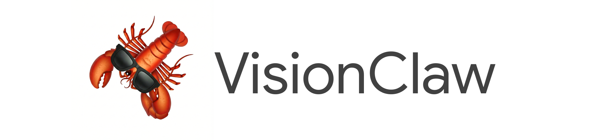

# droopdetection



A smart-glasses first-aid guidance system. Point the glasses (or your phone/laptop camera) at a patient — the backend runs two real-time CV models and an AI voice agent that talks you through what it sees:

- **Facial droop** — detects stroke-related asymmetry using MediaPipe landmarks + EfficientNet-B0
- **Heart rate** — contactless rPPG from skin colour (CHROM/POS ensemble, no contact needed)
- **Voice guidance** — Gemini agent backed by JRCALC 2022 clinical guidelines RAG


**Supported platforms:** browser webcam, iOS (iPhone), Android, Meta Ray-Ban glasses.

> The sample apps and some assets still use the earlier internal name `VisionClaw` — treat that as legacy branding, not a separate project.

## What's Working Now

| Component | Status |
|-----------|--------|
| FastAPI backend + WebSocket ingest | ✅ Live |
| Face droop detection (EfficientNet-B0 + MediaPipe landmarks) | ✅ Live |
| Heart rate detection (rPPG CHROM/POS ensemble) | ✅ Live |
| Browser webcam streaming + signal viewer | ✅ Live |
| Gemini voice agent with JRCALC RAG | ✅ Live (needs index build) |
| iOS / Android app streaming | ✅ Live |
| React debug dashboard | ✅ Live |

If you are joining this repo as a teammate, start here:

- [ARCHITECTURE.md](ARCHITECTURE.md) for the backend data-flow design
- [`backend/`](backend/) for the Python service
- [`viewer/`](viewer/) for the React debug dashboard
- [`mobile/CameraAccess/`](mobile/CameraAccess/) for the iOS prototype
- [`mobile/CameraAccessAndroid/`](mobile/CameraAccessAndroid/) for the Android prototype

## Quick Start (Browser Demo)

The fastest way to see both models running — no mobile hardware required.

**Prerequisites:** Python 3.11–3.13, Node 18+, a [Gemini API key](https://aistudio.google.com/apikey).

### 1. Clone and configure

```bash
git clone https://github.com/dtseng123/droopdetection.git
cd droopdetection
cp backend/.env.example backend/.env   # then set GEMINI_API_KEY
```

> **Model files required for droop detection.** The trained weights are not in the repo.
> Place these files before starting the backend:
> ```
> model/droop_model.onnx          ← EfficientNet-B0 ONNX weights
> model/face_landmarker.task      ← MediaPipe face landmarker (download from MediaPipe)
> checkpoints/threshold.json      ← calibrated detection threshold
> ```
> Heart rate works out of the box — the BlazeFace model downloads automatically on first run.

### 2. Start the backend

```bash
cd backend
make setup        # creates .venv, installs deps
make dev          # starts uvicorn on :8000
```

Health check:

```bash
curl http://127.0.0.1:8000/health
```

### 3. Start the viewer

```bash
cd viewer
npm install
npm run dev       # starts on http://localhost:5174
```

### 4. Stream your webcam

1. Open **http://localhost:5174**
2. Go to the **STREAMS** tab
3. Click **Start Camera** — your browser webcam streams to the backend at 10 fps
4. A 10-second warmup bar appears while the processors initialise
5. After warmup, two signal cards update in real time:
   - **Face droop** — probability and severity, updated each frame
   - **Heart rate** — BPM reading once the 150-frame rPPG buffer fills (~15 s)

### 5. Android / iOS (optional)

See the mobile quick-start sections below to stream from Meta Ray-Ban glasses or a phone camera instead of the browser webcam.

Useful commands:

```bash
make backend-test
make backend-restart
make backend-stop
```

## Secrets And Tokens

Start by copying the root inventory file:

```bash
cp .env.example .env
```

That root `.env` is the teammate-facing checklist for all keys used in this repo. The apps do not all read it directly, so use it as the place you collect values, then copy them into the runtime-specific files below.

### Where Each Secret Actually Goes

| Surface | File | What goes there |
|------|---------|---------|
| Root inventory | `.env` | Shared local checklist for Gemini, OpenAI, Stream, OpenClaw, and Meta/DAT values |
| Backend | `backend/.env` | Vision Agents / FastAPI runtime config |
| iOS sample app | `mobile/CameraAccess/CameraAccess/Secrets.swift` | `geminiAPIKey`, optional OpenClaw config, optional WebRTC signaling URL |
| Android sample app | `mobile/CameraAccessAndroid/app/src/main/java/com/meta/wearable/dat/externalsampleapps/cameraaccess/Secrets.kt` | `geminiAPIKey`, optional OpenClaw config, optional WebRTC signaling URL |
| Android DAT SDK | `mobile/CameraAccessAndroid/local.properties` | `github_token`, `mwdat_application_id`, `mwdat_client_token` |

### Backend `.env`

The backend already has a runnable template:

```bash
cp backend/.env.example backend/.env
```

Or use the Make target:

```bash
make backend-setup
```

Fill in these keys for the backend as needed:

- `GEMINI_API_KEY` for Gemini realtime
- `OPENAI_API_KEY` for OpenAI realtime
- `ELEVENLABS_API_KEY` if you want backend-generated PCM speech instead of Android local TTS fallback
- `STREAM_API_KEY` and `STREAM_API_SECRET` for the Vision Agents transport layer

The current Vision Agent backend mode defaults to:

- `SPEECH_PIPELINE=fast_whisper_pipeline`
- `FAST_WHISPER_MODEL_SIZE=base`
- `GEMINI_LLM_MODEL=gemini-3-flash-preview`
- `BACKEND_TTS_ENABLED=true`

If `ELEVENLABS_API_KEY` is absent, the backend still runs Fast-Whisper + Gemini and the Android app falls back to local TTS playback.
These values can also be overridden per session from the Android app Settings screen.

### Meta / DAT Android Tokens

The Android sample needs two different things:

1. A GitHub Packages token so Gradle can download the DAT Android SDK.
2. Meta Wearables app registration values when you are not relying on Developer Mode.

Create the Android local properties file:

```bash
cp mobile/CameraAccessAndroid/local.properties.example mobile/CameraAccessAndroid/local.properties
```

Then fill in:

- `github_token`
  - create a GitHub Personal Access Token with `read:packages`
  - GitHub path: `Settings -> Developer settings -> Personal access tokens`
- `mwdat_application_id`
  - use `0` in Developer Mode
  - for production, get the real value from Wearables Developer Center
- `mwdat_client_token`
  - empty in simple Developer Mode workflows if not required by your current setup
  - for production, get the real value from Wearables Developer Center

Important:

- `mobile/CameraAccessAndroid/settings.gradle.kts` reads `github_token`
- `mobile/CameraAccessAndroid/app/build.gradle.kts` reads `mwdat_application_id` and `mwdat_client_token`
- `mobile/CameraAccessAndroid/app/src/main/AndroidManifest.xml` injects those into the DAT manifest metadata

### iOS And Android App Secrets

Create the sample app secrets files:

```bash
cp mobile/CameraAccess/CameraAccess/Secrets.swift.example mobile/CameraAccess/CameraAccess/Secrets.swift
cp mobile/CameraAccessAndroid/app/src/main/java/com/meta/wearable/dat/externalsampleapps/cameraaccess/Secrets.kt.example mobile/CameraAccessAndroid/app/src/main/java/com/meta/wearable/dat/externalsampleapps/cameraaccess/Secrets.kt
```

At minimum, set:

- `geminiAPIKey`

Optional:

- OpenClaw host and tokens
- WebRTC signaling URL

## Repo Map

| Path | Purpose |
|------|---------|
| `mobile/CameraAccess/` | Current iOS smart-glasses / iPhone prototype |
| `mobile/CameraAccessAndroid/` | Current Android smart-glasses / phone prototype |
| `mobile/CameraAccess/server/` | Current WebRTC signaling server for the existing browser viewer |
| `backend/` | New FastAPI + Vision Agents scaffold for the planned backend |
| `viewer/` | React debug dashboard for backend session state, transcripts, and processor signals |
| [`ARCHITECTURE.md`](ARCHITECTURE.md) | Planned backend-first Python + React system |

Compatibility note: `samples/CameraAccessAndroid` is kept as a forwarding symlink for older Android Studio projects and scripts. The canonical Android app path is `mobile/CameraAccessAndroid/`.

## Product Direction

The long-term product direction for this repo is a first-aid guidance system:

- the glasses wearer streams live video/audio from their point of view
- the backend runs custom vision models and other integrations through processors and tools
- private medical / first-aid knowledge can be retrieved through RAG
- the wearer receives voice guidance
- judges, developers, and operators can inspect the augmented video and agent traces in a debug dashboard

The current mobile apps are still the working prototype surface. The backend-first system is the next build target.

## Current Prototype

Put on your glasses, tap the AI button, and talk:

- **"What am I looking at?"** -- Gemini sees through your glasses camera and describes the scene
- **"Add milk to my shopping list"** -- delegates to OpenClaw, which adds it via your connected apps
- **"Send a message to John saying I'll be late"** -- routes through OpenClaw to WhatsApp/Telegram/iMessage
- **"Search for the best coffee shops nearby"** -- web search via OpenClaw, results spoken back

The glasses camera streams at ~1fps to Gemini for visual context, while audio flows bidirectionally in real-time.

## Current Mobile Flow


```
Meta Ray-Ban Glasses (or phone camera)
       |
       | video frames + mic audio
       v
iOS / Android App (this project)
       |
       | JPEG frames (~1fps) + PCM audio (16kHz)
       v
Gemini Live API (WebSocket)
       |
       |-- Audio response (PCM 24kHz) --> App --> Speaker
       |-- Tool calls (execute) -------> App --> OpenClaw Gateway
       |                                              |
       |                                              v
       |                                      56+ skills: web search,
       |                                      messaging, smart home,
       |                                      notes, reminders, etc.
       |                                              |
       |<---- Tool response (text) <----- App <-------+
       |
       v
  Gemini speaks the result
```

**Key pieces:**
- **Gemini Live** -- real-time voice + vision AI over WebSocket (native audio, not STT-first)
- **OpenClaw** (optional) -- local gateway that gives Gemini access to 56+ tools and all your connected apps
- **Phone mode** -- test the full pipeline using your phone camera instead of glasses
- **WebRTC streaming** -- share your glasses POV live to a browser viewer

For the planned backend-first flow, see [ARCHITECTURE.md](ARCHITECTURE.md).

## How the Backend Works

```
Browser / iOS / Android
        │
        │  JPEG frames @ 10 fps  (WebSocket)
        ▼
┌─────────────────────────────────────────┐
│           FastAPI backend               │
│                                         │
│  ┌──────────────────────────────────┐   │
│  │        VideoForwarder            │   │
│  │  (fan-out to all processors)     │   │
│  └────────┬──────────────┬──────────┘   │
│           │              │              │
│           ▼              ▼              │
│  ┌──────────────┐ ┌────────────────┐   │
│  │ FaceDroop    │ │ HeartRate      │   │
│  │ Processor    │ │ Processor      │   │
│  │              │ │                │   │
│  │ MediaPipe    │ │ MediaPipe face │   │
│  │ landmarks    │ │ detect         │   │
│  │ + asymmetry  │ │ + CHROM/POS    │   │
│  │ gate         │ │ rPPG ensemble  │   │
│  │ + EfficientNet│ │ + centroid     │   │
│  │ -B0 ONNX     │ │ tracker        │   │
│  └──────┬───────┘ └───────┬────────┘   │
│         │                 │             │
│         └────────┬────────┘             │
│                  ▼                      │
│         processor_signals{}             │
│         (polled by viewer)              │
│                                         │
│  ┌──────────────────────────────────┐   │
│  │   Gemini voice agent             │   │
│  │   + JRCALC RAG (optional)        │   │
│  └──────────────────────────────────┘   │
└─────────────────────────────────────────┘
        │
        │  JSON polling  (REST)
        ▼
   React viewer (http://localhost:5174)
   └── DEBUG tab: frame overlay, transcript, event trace
   └── STREAMS tab: webcam feed + live signal cards
```

### Face droop detection

1. Each frame is passed through MediaPipe face landmarker to extract 468 landmarks.
2. Mouth/eye/brow asymmetry is computed from left–right landmark differences.
3. **Asymmetry gate**: if the face is symmetric (combined score < 0.030) the CNN is skipped and the frame is logged as not drooping. This eliminates false positives on resting faces.
4. If asymmetry exceeds the gate, an EfficientNet-B0 ONNX model runs on the forehead crop. The final probability is the CNN output scaled by the asymmetry weight.
5. Severity bands: `none / mild / severe` based on distance from the calibrated threshold.

### Heart rate (rPPG)

1. MediaPipe detects faces each frame; a centroid tracker maintains identity across frames.
2. A forehead ROI is cropped and Gaussian pyramid–downsampled.
3. ROIs accumulate in a 150-frame rolling buffer (~15 s at 10 fps).
4. When the buffer is full, CHROM and POS colour-space BVP estimators run and their spectra are averaged. The dominant peak in the physiological band (60–120 BPM) gives the heart rate.
5. Frame-diff motion rejection discards blurry or high-motion frames before they enter the buffer.

### API surfaces

| Endpoint | Purpose |
|----------|---------|
| `POST /sessions` | Create ingest session |
| `WS /sessions/{id}/stream` | Stream JPEG frames + audio |
| `GET /sessions` | List active sessions |
| `GET /sessions/{id}` | Session state + processor signals |
| `GET /sessions/{id}/frame` | Latest annotated preview JPEG |
| `GET /health` | Liveness check |

### Key files

| File | Purpose |
|------|---------|
| `backend/app/processors/face_droop.py` | Droop processor |
| `backend/app/processors/droop_inference.py` | ONNX wrapper + asymmetry gate |
| `backend/app/preprocess.py` | MediaPipe landmark extraction |
| `backend/app/processors/heart_rate/processor.py` | rPPG processor |
| `backend/app/processors/heart_rate/signal_processor.py` | CHROM/POS BVP estimators |
| `backend/app/agent_factory.py` | Wires processors + LLM + RAG |
| `viewer/src/CameraStream.tsx` | Webcam streaming + signal cards |

---

## Quick Start: Current iOS Prototype

### 1. Clone and open

```bash
git clone https://github.com/dtseng123/droopdetection.git
cd droopdetection/mobile/CameraAccess
open CameraAccess.xcodeproj
```

### 2. Add your secrets

Copy the example file and fill in your values:

```bash
cp CameraAccess/Secrets.swift.example CameraAccess/Secrets.swift
```

Edit `Secrets.swift` with your [Gemini API key](https://aistudio.google.com/apikey) (required) and optional OpenClaw/WebRTC config.

### 3. Build and run

Select your iPhone as the target device and hit Run (Cmd+R).

### 4. Try it out

**Without glasses (iPhone mode):**
1. Tap **"Start on iPhone"** -- uses your iPhone's back camera
2. Tap the **AI button** to start a Gemini Live session
3. Talk to the AI -- it can see through your iPhone camera

**With Meta Ray-Ban glasses:**

First, enable Developer Mode in the Meta AI app:

1. Open the **Meta AI** app on your iPhone
2. Go to **Settings** (gear icon, bottom left)
3. Tap **App Info**
4. Tap the **App version** number **5 times** -- this unlocks Developer Mode
5. Go back to Settings -- you'll now see a **Developer Mode** toggle. Turn it on.


Then in the iOS app:
1. Tap **"Start Streaming"** in the app
2. Tap the **AI button** for voice + vision conversation

---

## Quick Start: Current Android Prototype

### 1. Clone and open

```bash
git clone https://github.com/dtseng123/droopdetection.git
```

Open `mobile/CameraAccessAndroid/` in Android Studio.

### 2. Configure GitHub Packages (DAT SDK)

The Meta DAT Android SDK is distributed via GitHub Packages. You need a GitHub Personal Access Token with `read:packages` scope.

1. Go to [GitHub > Settings > Developer Settings > Personal Access Tokens](https://github.com/settings/tokens) and create a **classic** token with `read:packages` scope
2. In `mobile/CameraAccessAndroid/local.properties`, add:

```properties
github_token=YOUR_GITHUB_TOKEN
```

> **Tip:** If you have the `gh` CLI installed, you can run `gh auth token` to get a valid token. Make sure it has `read:packages` scope -- if not, run `gh auth refresh -s read:packages`.
>
> **Note:** GitHub Packages requires authentication even for public repositories. The 401 error means your token is missing or invalid.

### 3. Add your secrets

```bash
cd mobile/CameraAccessAndroid/app/src/main/java/com/meta/wearable/dat/externalsampleapps/cameraaccess/
cp Secrets.kt.example Secrets.kt
```

Edit `Secrets.kt` with your [Gemini API key](https://aistudio.google.com/apikey) (required) and optional OpenClaw/WebRTC config.

### 4. Build and run

1. Let Gradle sync in Android Studio (it will download the DAT SDK from GitHub Packages)
2. Select your Android phone as the target device
3. Click Run (Shift+F10)

> **Wireless debugging:** You can also install via ADB wirelessly. Enable **Wireless debugging** in your phone's Developer Options, then pair with `adb pair <ip>:<port>`.

### 5. Try it out

**Without glasses (Phone mode):**
1. Tap **"Start on Phone"** -- uses your phone's back camera
2. Tap the **AI button** (sparkle icon) to start a Gemini Live session
3. Talk to the AI -- it can see through your phone camera

**With Meta Ray-Ban glasses:**

Enable Developer Mode in the Meta AI app (same steps as iOS above), then:
1. Tap **"Start Streaming"** in the app
2. Tap the **AI button** for voice + vision conversation

---

## Setup: OpenClaw (Optional)

OpenClaw gives Gemini the ability to take real-world actions: send messages, search the web, manage lists, control smart home devices, and more. Without it, Gemini is voice + vision only.

### 1. Install and configure OpenClaw

Follow the [OpenClaw setup guide](https://github.com/nichochar/openclaw). Make sure the gateway is enabled:

In `~/.openclaw/openclaw.json`:

```json
{
  "gateway": {
    "port": 18789,
    "bind": "lan",
    "auth": {
      "mode": "token",
      "token": "your-gateway-token-here"
    },
    "http": {
      "endpoints": {
        "chatCompletions": { "enabled": true }
      }
    }
  }
}
```

Key settings:
- `bind: "lan"` -- exposes the gateway on your local network so your phone can reach it
- `chatCompletions.enabled: true` -- enables the `/v1/chat/completions` endpoint (off by default)
- `auth.token` -- the token your app will use to authenticate

### 2. Configure the app

**iOS** -- In `Secrets.swift`:
```swift
static let openClawHost = "http://Your-Mac.local"
static let openClawPort = 18789
static let openClawGatewayToken = "your-gateway-token-here"
```

**Android** -- In `Secrets.kt`:
```kotlin
const val openClawHost = "http://Your-Mac.local"
const val openClawPort = 18789
const val openClawGatewayToken = "your-gateway-token-here"
```

To find your Mac's Bonjour hostname: **System Settings > General > Sharing** -- it's shown at the top (e.g., `Johns-MacBook-Pro.local`).

> Both iOS and Android also have an in-app Settings screen where you can change these values at runtime without editing source code.

### 3. Start the gateway

```bash
openclaw gateway restart
```

Verify it's running:

```bash
curl http://localhost:18789/health
```

Now when you talk to the AI, it can execute tasks through OpenClaw.

---

## Current Mobile Architecture

### Key Files (iOS)

All source code is in `mobile/CameraAccess/CameraAccess/`:

| File | Purpose |
|------|---------|
| `Gemini/GeminiConfig.swift` | API keys, model config, system prompt |
| `Gemini/GeminiLiveService.swift` | WebSocket client for Gemini Live API |
| `Gemini/AudioManager.swift` | Mic capture (PCM 16kHz) + audio playback (PCM 24kHz) |
| `Gemini/GeminiSessionViewModel.swift` | Session lifecycle, tool call wiring, transcript state |
| `OpenClaw/ToolCallModels.swift` | Tool declarations, data types |
| `OpenClaw/OpenClawBridge.swift` | HTTP client for OpenClaw gateway |
| `OpenClaw/ToolCallRouter.swift` | Routes Gemini tool calls to OpenClaw |
| `iPhone/IPhoneCameraManager.swift` | AVCaptureSession wrapper for iPhone camera mode |
| `WebRTC/WebRTCClient.swift` | WebRTC peer connection + SDP negotiation |
| `WebRTC/SignalingClient.swift` | WebSocket signaling for WebRTC rooms |

### Key Files (Android)

All source code is in `mobile/CameraAccessAndroid/app/src/main/java/.../cameraaccess/`:

| File | Purpose |
|------|---------|
| `gemini/GeminiConfig.kt` | API keys, model config, system prompt |
| `gemini/GeminiLiveService.kt` | OkHttp WebSocket client for Gemini Live API |
| `gemini/AudioManager.kt` | AudioRecord (16kHz) + AudioTrack (24kHz) |
| `gemini/GeminiSessionViewModel.kt` | Session lifecycle, tool call wiring, UI state |
| `openclaw/ToolCallModels.kt` | Tool declarations, data classes |
| `openclaw/OpenClawBridge.kt` | OkHttp HTTP client for OpenClaw gateway |
| `openclaw/ToolCallRouter.kt` | Routes Gemini tool calls to OpenClaw |
| `phone/PhoneCameraManager.kt` | CameraX wrapper for phone camera mode |
| `webrtc/WebRTCClient.kt` | WebRTC peer connection (stream-webrtc-android) |
| `webrtc/SignalingClient.kt` | OkHttp WebSocket signaling for WebRTC rooms |
| `settings/SettingsManager.kt` | SharedPreferences with Secrets.kt fallback |

### Audio Pipeline

- **Input**: Phone mic -> AudioManager (PCM Int16, 16kHz mono, 100ms chunks) -> Gemini WebSocket
- **Output**: Gemini WebSocket -> AudioManager playback queue -> Phone speaker
- **iOS iPhone mode**: Uses `.voiceChat` audio session for echo cancellation + mic gating during AI speech
- **iOS Glasses mode**: Uses `.videoChat` audio session (mic is on glasses, speaker is on phone -- no echo)
- **Android**: Uses `VOICE_COMMUNICATION` audio source for built-in acoustic echo cancellation

### Video Pipeline

- **Glasses**: DAT SDK video stream (24fps) -> throttle to ~1fps -> JPEG (50% quality) -> Gemini
- **Phone**: Camera capture (30fps) -> throttle to ~1fps -> JPEG -> Gemini

### Tool Calling

Gemini Live supports function calling. Both apps declare a single `execute` tool that routes everything through OpenClaw:

1. User says "Add eggs to my shopping list"
2. Gemini speaks "Sure, adding that now" (verbal acknowledgment before tool call)
3. Gemini sends `toolCall` with `execute(task: "Add eggs to the shopping list")`
4. `ToolCallRouter` sends HTTP POST to OpenClaw gateway
5. OpenClaw executes the task using its 56+ connected skills
6. Result returns to Gemini via `toolResponse`
7. Gemini speaks the confirmation

### WebRTC Live Streaming

Share your glasses POV in real-time to a browser viewer with bidirectional audio and video.

1. Tap the **Live** button in the app
2. The app connects to a signaling server and gets a 6-character room code
3. Share the code -- the viewer opens the server URL in a browser and enters it
4. WebRTC peer connection is established (SDP + ICE via the signaling server)
5. Media flows peer-to-peer: glasses video to browser, browser camera back to iOS PiP

**Key details:**
- **Signaling server**: Node.js + WebSocket, located at `mobile/CameraAccess/server/` -- serves the browser viewer and relays SDP/ICE
- **NAT traversal**: Google STUN servers + ExpressTURN relay (fetched from `/api/turn`)
- **Video**: 24 fps, 2.5 Mbps max bitrate
- **Background handling**: 60-second grace period for iOS app backgrounding -- room stays alive for reconnection
- **Constraint**: Cannot run simultaneously with Gemini Live (audio device conflict)

For full details, see [`mobile/CameraAccess/CameraAccess/WebRTC/README.md`](mobile/CameraAccess/CameraAccess/WebRTC/README.md).

---

## Requirements

### iOS
- iOS 17.0+
- Xcode 15.0+
- Gemini API key ([get one free](https://aistudio.google.com/apikey))
- Meta Ray-Ban glasses (optional -- use iPhone mode for testing)
- OpenClaw on your Mac (optional -- for agentic actions)

### Android
- Android 14+ (API 34+)
- Android Studio Ladybug or newer
- GitHub account with `read:packages` token (for DAT SDK)
- Gemini API key ([get one free](https://aistudio.google.com/apikey))
- Meta Ray-Ban glasses (optional -- use Phone mode for testing)
- OpenClaw on your Mac (optional -- for agentic actions)

---

## Troubleshooting

### General

**Gemini doesn't hear me** -- Check that microphone permission is granted. The app uses aggressive voice activity detection -- speak clearly and at normal volume.

**OpenClaw connection timeout** -- Make sure your phone and Mac are on the same Wi-Fi network, the gateway is running (`openclaw gateway restart`), and the hostname matches your Mac's Bonjour name.

**OpenClaw opens duplicate browser tabs** -- This is a known upstream issue in OpenClaw's CDP (Chrome DevTools Protocol) connection management ([#13851](https://github.com/nichochar/openclaw/issues/13851), [#12317](https://github.com/nichochar/openclaw/issues/12317)). Using `profile: "openclaw"` (managed Chrome) instead of the default extension relay may improve stability.

### iOS-specific

**"Gemini API key not configured"** -- Add your API key in Secrets.swift or in the in-app Settings.

**Echo/feedback in iPhone mode** -- The app mutes the mic while the AI is speaking. If you still hear echo, try turning down the volume.

### Android-specific

**Gradle sync fails with 401 Unauthorized** -- Your GitHub token is missing or doesn't have `read:packages` scope. Check `mobile/CameraAccessAndroid/local.properties` for `github_token`, or set `GITHUB_TOKEN` in your environment. Generate a token at [github.com/settings/tokens](https://github.com/settings/tokens).

**Gemini WebSocket times out** -- The Gemini Live API sends binary WebSocket frames. If you're building a custom client, make sure to handle both text and binary frame types.

**Audio not working** -- Ensure `RECORD_AUDIO` permission is granted. On Android 13+, you may need to grant this permission manually in Settings > Apps.

**Phone camera not starting** -- Ensure `CAMERA` permission is granted. CameraX requires both the permission and a valid lifecycle.

For DAT SDK issues, see the [developer documentation](https://wearables.developer.meta.com/docs/develop/) or the [discussions forum](https://github.com/facebook/meta-wearables-dat-ios/discussions).

## License

This source code is licensed under the license found in the [LICENSE](LICENSE) file in the root directory of this source tree.
